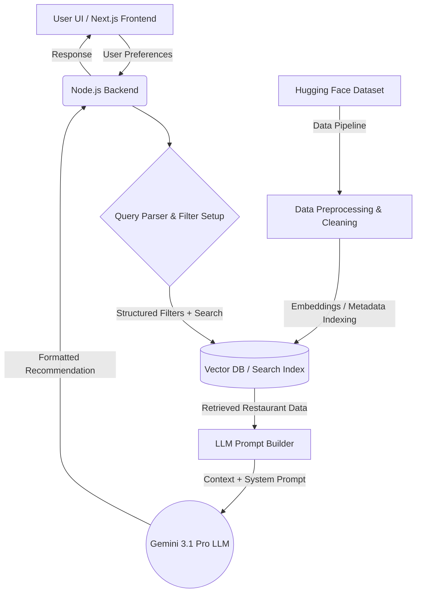

# Architecture: AI Restaurant Recommendation Service

## Overview
This document outlines the architecture for the AI Restaurant Recommendation Service. The system leverages the Zomato dataset from Hugging Face (`ManikaSaini/zomato-restaurant-recommendation`) to provide tailored restaurant recommendations using an LLM based on user preferences: **Price**, **Place**, **Rating**, and **Cuisine**. The system follows a Retrieval-Augmented Generation (RAG) approach to ensure accurate and context-aware responses without hallucinating non-existent restaurants.

---

## High-Level Architecture Flow

---

## Project Phases

### Phase 1: Data Ingestion & Preprocessing
*Objective: Prepare the raw dataset for querying and formulation.*
1. **Source**: Fetch `ManikaSaini/zomato-restaurant-recommendation` from Hugging Face.
2. **Cleaning**: Handle any missing values, normalize price metrics (e.g., cost for two), and standardize location and cuisine names.
3. **Transformation**: Convert the tabular data into rich text descriptions (e.g., *"Restaurant X is a highly rated 4.5 star Italian place in Downtown, costing $50 for two"*) to facilitate vector embedding, while also maintaining structured metadata for exact filtering.

### Phase 2: Storage & Retrieval Pipeline Setup
*Objective: Efficiently store and retrieve relevant restaurant data based on preferences.*
1. **Database Selection**: Use a Vector Database (e.g., ChromaDB, Qdrant, or Pinecone) that supports metadata filtering. Alternatively, a traditional DB with full-text search (like PostgreSQL) can work if relying heavily on exact filtering.
2. **Indexing**: 
   - Embed the rich text descriptions using an embedding model.
   - Store exact values (Price, Place, Rating, Cuisine) as metadata alongside the embeddings.
3. **Retrieval Logic**: When a query comes in, filter the DB first by precise parameters (e.g., `Rating >= 4.0`, `Place == "specific location"`, `Cuisine contains "Italian"`) and then perform a semantic search to rank the most relevant options.

### Phase 3: LLM Integration (RAG Module)
*Objective: Generate human-like, clear, and actionable recommendations.*
1. **Context Assembly**: Take the top N retrieved restaurants from the database and format them into readable text.
2. **Prompt Engineering**: Combine the retrieved restaurant contexts with the user's specific request into a strict system prompt. 
   - *Example Prompt*: "You are a helpful restaurant assistant. Based ONLY on the following dataset results, recommend the best options for the user based on their preferences. Explain why you chose them, mentioning price, place, and ratings."
3. **LLM Invocation**: Pass the prompt to the specifically selected **Gemini 3.1 Pro LLM** to generate the final conversational and highly accurate response.

### Phase 4: Backend Service Development
*Objective: Serve the recommendation logic via an API.*
1. **Framework**: Node.js (e.g., Express or NestJS) for creating the backend API.
2. **Endpoints**: 
   - `POST /api/v1/recommend`: Accepts a JSON payload containing `{"place": "...", "cuisine": "...", "price_range": "...", "min_rating": 4.0}` and returns the LLM's response.
3. **Integration**: Link the API endpoint to the retrieval functions and the Gemini 3.1 Pro LLM module.

### Phase 5: User Interface (Frontend)
*Objective: Provide an easy-to-use, responsive interface for the end-user.*
1. **Framework**: Next.js (React) for a robust, fast, and feature-rich user interface.
2. **Features**:
   - Clean form inputs, sliders, and dropdowns for Price, Place, Rating, and Cuisine.
   - A dedicated UI page displaying the LLM-generated recommendations, surfacing restaurant names, reasoning, and key details clearly.

### Phase 6: Deployment & Operations (Optional/Future)
*Objective: Make the application publicly accessible and maintainable.*
1. **Containerization**: Dockerize the Node.js backend and Next.js frontend.
2. **Hosting**: Deploy using services like Vercel (for Next.js) and Render, Heroku, or AWS (for Node.js).
3. **Monitoring**: Track LLM latency and API errors.
---

## Core Tech Stack Summary
- **Data Source**: Hugging Face Datasets
- **Backend / Core Engine**: Node.js
- **Data Storage**: ChromaDB / Pinecone (Vector + Metadata)
- **LLM Orchestration**: LangChain.js or LlamaIndex (TypeScript/JavaScript port)
- **Large Language Model**: Gemini 3.1 Pro
- **Frontend**: Next.js
